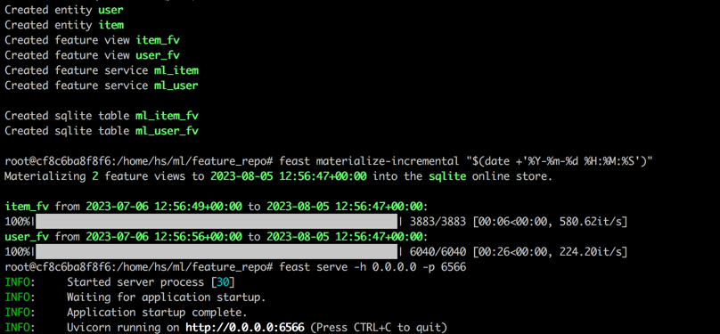

# 1 离线
## 1.0 创建conda环境并安装依赖
```bash
conda create -n rsppl python=3.8
conda activate rsppl
conda install --file requirements.txt --channel anaconda --channel conda-forge
```

## 1.1 预处理
```bash
cd offline/preprocess/
python s1_data_split.py
python s2_term_trans.py
```

## 1.2 term和vector召回
```bash
cd offline/recall/
python s1_term_recall.py
python s2_vector_recall.py
```

## 1.3 特征工程与DeepFM排序
```bash
cd offline/rank/
python s1_feature_engi.py
python s2_model_train.py
```

# 2 离线同步至在线
## 2.0 docker镜像下载
```bash
docker pull redis:6.0.0
docker pull elasticsearch:8.8.0
docker pull feastdev/feature-server:0.31.0
docker pull nvcr.io/nvidia/tritonserver:20.12-py3
```

## 2.1 user标签和向量进Redis
启动redis容器并保持后台执行
```bash
docker run --name redis -p 6379:6379 -d redis:6.0.0
```
同步数据并校验，如果有下图输出，代表数据校验成功
```bash
cd offline_to_online/recall/
python s1_user_to_redis.py
```


## 2.2 item标签和向量进elasticsearch
启动es容器并进入内部终端
```bash
docker run --name es8 -p 9200:9200 -it elasticsearch:8.8.0
```
复制下图位置的密钥，粘贴为data_exchange_center/constants.py文件中ES_KEY的值，因为es从版本8开始要强制进行密码验证  

粘贴完成后，ctrl+C退出内部终端，此时容器也会停止运行，所以我们需要重新启动es容器并保持后台执行  
```bash
docker start es8
```
同步数据并校验，如果有下图输出，代表数据校验成功
```bash
cd offline_to_online/recall/
python s2_item_to_es.py
```


## 2.3 user和item特征进Feast
将特征文件由csv转为parquet格式以满足feast的要求
```bash
cd offline_to_online/rank/
python s1_feature_to_feast.py
```
新启动终端2，输入以下命令启动feast并进入容器内部
```bash
cd data_exchange_center/online/feast
docker run --rm --name feast-server --entrypoint "bash" -v $(pwd):/home/hs -p 6566:6566 -it feastdev/feature-server:0.31.0
```
下面的命令在docker容器内部终端执行
```bash
# 进入同步目录
cd /home/hs/ml/feature_repo
# 根据配置文件初始化特征仓库（读取parquet建立db）
feast apply
# 特征由离线同步至在线（默认sqlite，可以切换redis等）
feast materialize-incremental "$(date +'%Y-%m-%d %H:%M:%S')"
# 启动特征服务
feast serve -h 0.0.0.0 -p 6566
```
全部执行完成后，会有下图一样的输出  
  
回到终端1输入以下命令，测试feast是否已正常服务，如果成功会返回一串json
```bash
curl -X POST \
  "http://localhost:6566/get-online-features" \
  -d '{
    "feature_service": "ml_item",
    "entities": {
      "itemid": [1,3,5]
    }
  }'
```

## 2.4 PyTorch转ONNX进Triton
将pytorch模型导出为onnx格式
```bash
cd offline_to_online/rank/
python s2_model_to_triton.py
```
新启动终端3，输入以下命令启动triton并进入容器内部，会有下图一样的输出
```bash
cd data_exchange_center/online/triton
docker run --rm -p8000:8000 -p8001:8001 -p8002:8002 -v $(pwd)/:/models/ nvcr.io/nvidia/tritonserver:20.12-py3 tritonserver --model-repository=/models/
```

回到终端1运行以下命令，测试模型线下与线上打分是否一致
```bash
cd offline_to_online/rank/
python s3_check_offline_and_online.py
```
如图，线下与线下打分完全一致，测试通过  


# 3 在线
## 3.1 server启动
新启动终端4，输入以下命令启动flask web server，会有下图输出
```bash
cd online/main
flask --app s1_server.py run --host=0.0.0.0
```
  
## 3.2 client调用
回到终端1，测试客户端调用，获取json格式的推荐结果，如果展示了top50的推荐列表
```bash
cd online/main
python s2_client.py
```
   